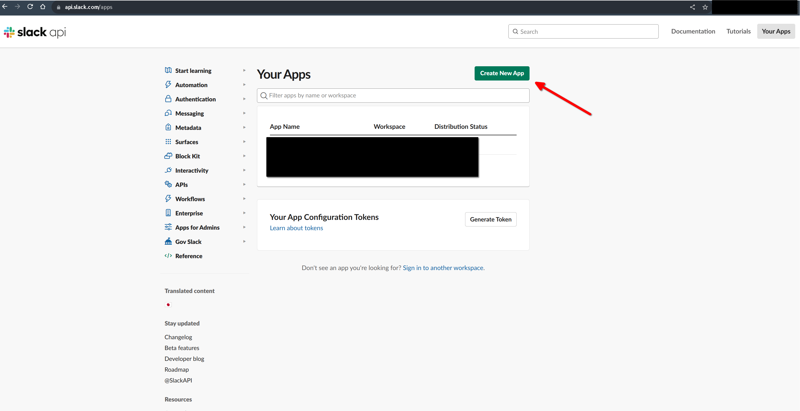
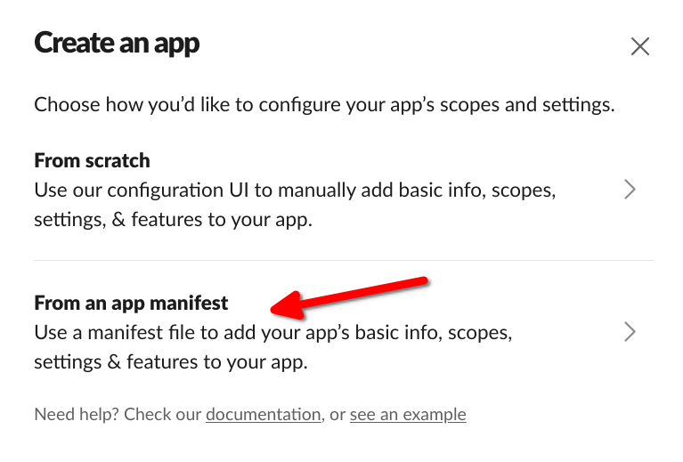
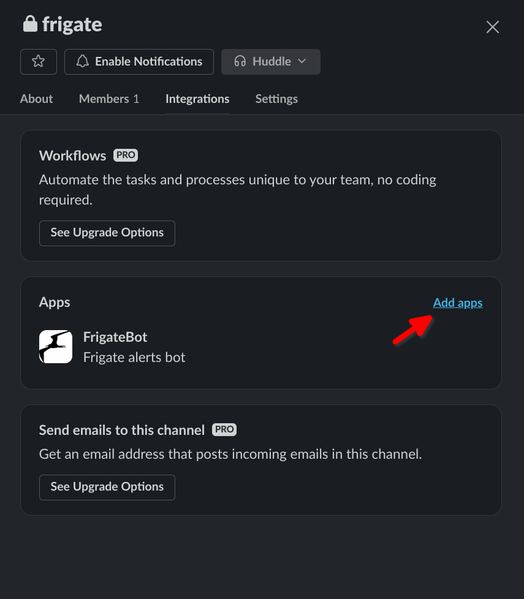

# Frigate Slack Alerts

Get Slack alerts for Frigate events with snapshots and filters.

Not assosiated with Frigate or Slack.

## Quick Start

1.  Create a slack channel for alerts (the default channel name is `frigate`)
2.  Go to the [Slack API page](https://api.slack.com/apps) and create a new app
    
3.  Choose to create the app from a manifest
    
4.  Paste in the following manifest:
    ```yml
    _metadata:
      major_version: 1
      minor_version: 1
    display_information:
      name: frigate-bot
      description: Frigate alerts bot
      background_color: '#232c34'
    features:
      bot_user:
        display_name: FrigateBot
        always_online: true
      app_home:
        home_tab_enabled: false
        messages_tab_enabled: true
        messages_tab_read_only_enabled: true
    oauth_config:
      scopes:
        bot:
          - app_mentions:read
          - channels:history
          - channels:join
          - channels:manage
          - channels:read
          - chat:write.customize
          - chat:write.public
          - chat:write
          - files:read
          - files:write
          - groups:history
          - groups:read
          - groups:write
          - im:history
          - im:read
          - im:write
          - links:read
          - links:write
          - mpim:history
          - mpim:read
          - mpim:write
          - pins:read
          - pins:write
          - reactions:read
          - reactions:write
          - reminders:read
          - reminders:write
          - team:read
          - usergroups:read
          - usergroups:write
          - users:read
          - users:write
          - users.profile:read
    settings:
      event_subscriptions:
        bot_events:
          - app_mention
      interactivity:
        is_enabled: true
      org_deploy_enabled: false
      socket_mode_enabled: true
    ```
5.  Click "Install App" from the menu
6.  After insalling the app to your workspace, you should see the "Bot User OAuth Token" on this page, save that for later.
    
7.  In slack, click on the menu for your channel, and add the new app to the channel
    
8.  Create a password file for Mosquitto MQTT broker (`/data/mqtt/password.txt` in this example)
    ```sh
    touch /data/mqtt/password.txt
    # User for frigate
    mosquitto_passwd /data/mqtt/password.txt frigate
    # User for alerts
    mosquitto_passwd /data/mqtt/password.txt alerts
    ```
9.  Create a config for Mosquitto MQTT broker (`/data/mqtt/config/mosquitto.conf` in this example)
    ```txt
    allow_anonymous false
    password_file /mosquitto/config/password.txt
    # MQTT
    listener 1883 0.0.0.0
    protocol mqtt
    ```
10. Add an MQTT broker and this project to your docker-compose file
    ```yml
    version: '3.9'
    services:
      mqtt:
        container_name: mqtt
        restart: unless-stopped
        image: eclipse-mosquitto
        volumes:
          - '/data/mqtt/config/mosquitto.conf:/mosquitto/config/mosquitto.conf'
          - '/data/mqtt/password.txt:/mosquitto/config/password.txt'
      alerts:
        container_name: alerts
        restart: unless-stopped
        image: ghcr.io/dlford/frigate-slack-alerts:latest
        environment:
          FSA_MQTT_BROKER: mqtt
          FSA_MQTT_USER: alerts
          FSA_MQTT_PASSWORD: 'ChangeMe123'
          FSA_FRIGATE_INTERNAL_BASEURL: http://frigate:5000
          FSA_FRIGATE_EXTERNAL_BASEURL: 'https://frigate.yourdomain.com'
          FSA_SLACK_TOKEN: 'Your_Slack_OAuth_API_Token'
      frigate:
        # ... See https://docs.frigate.video/frigate/installation
    ```
11. Add MQTT settings in your Frigate configuration file
    ```yml
    # See https://docs.frigate.video/configuration/
    mqtt:
      enabled: True
      host: mqtt
      port: 1883
      user: frigate
      password: ChangeMe123
    ```

## Advanced

### Environment Variables

The following environment variables can be added to the `environment` section of `docker-compose.yml`:

- `FSA_MQTT_BROKER`: Hostname of MQTT broker
- `FSA_MQTT_PORT`: Port of MQTT broker
- `FSA_MQTT_USER`: Username for MQTT broker
- `FSA_MQTT_PASSWORD`: Password for MQTT broker
- `FSA_MQTT_CLIENT_ID`: Client ID for MQTT broker, default is `go-frigate-slack-alerts`
- `FSA_FRIGATE_TOPIC_PREFIX`: MQTT topic prefix of Frigate, default is `frigate`
- `FSA_FRIGATE_INTERNAL_BASEURL`: HTTP path to Frigate container, used for fetching snapshot images
- `FSA_FRIGATE_EXTERNAL_BASEURL`: HTTP path to Frigate from the user end, you can use the IP address of your host if you don't have external access
- `FSA_SLACK_TOKEN`: Slack OAuth API Token for your Slack App
- `FSA_SLACK_CHANNEL`: Slack Channel to send alerts to (Slack App must be added to this channel)
- `FSA_FILTER_CONFIG_FILE`: Path to a filters config file, see below. This file must be mounted as a volume to the alerts container

### Filters

You may want to have some events recorded but not send alerts, this is possible with event filters. By default, all event alerts are sent to Slack, but if you add a filters file, only events described in the filters will be sent to Slack.

1. Create a `filters.yml` file (`/data/alerts.filters.yml` in this example)
   ```yml
   # Cameras not included in this list will not be alerted
   cameras:
     - name: camera1
       # Zones not included in this list will not be alerted for this camera
       zones:
         - name: zone1
           # Objects not included in this list will not be alerted for this zone
           objects:
             - person
             - dog
   ```
2. Mount the file as a volume to the alerts container
   ```yml
   version: '3.9'
   services:
     mqtt:
       # ...
     alerts:
       # ...
       volumes:
         - '/data/alerts/filters.yml:/app/filters.yml'
       # ...
   ```
3. Tell the app where to find the filters file with the `FSA_FILTER_CONFIG_FILE` environment variable
   ```yml
   version: '3.9'
   services:
     mqtt:
       # ...
     alerts:
       # ...
       volumes:
         - '/data/alerts/filters.yml:/app/filters.yml'
       environment:
         FSA_FILTER_CONFIG_FILE: /app/filters.yml
       # ...
   ```
